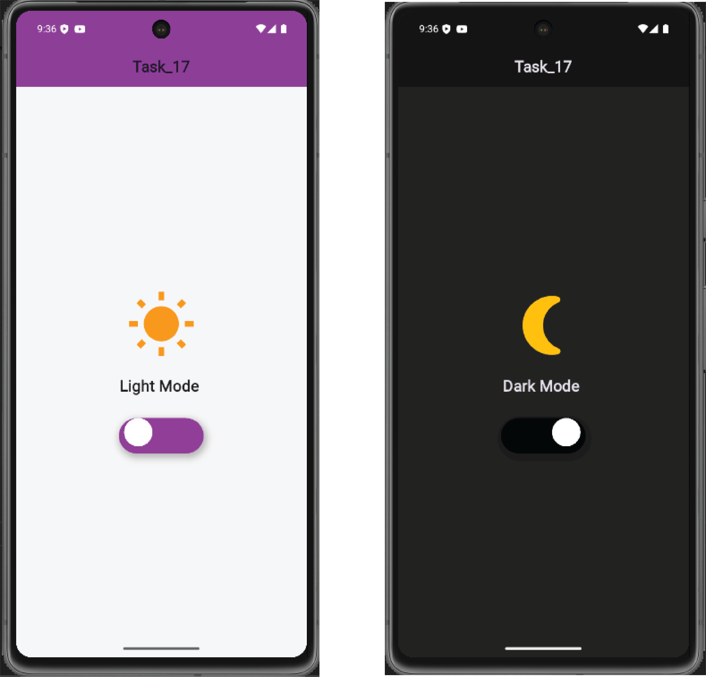

# Flutter Practice Tracker

## About the Repository

This repository is created as part of my Flutter development practice journey.  
It contains solutions to tasks and problems given in our practice sheet by my course Instructor. Through this collection, I aim to improve my Flutter skills, understand different UI/UX components, and strengthen my mobile app development knowledge.

Each problem includes its statement and the corresponding solution in the form of screenshots  for clear understanding and progress tracking.

## Author

**Name:** Umme Salma Lamyea  
**Section:** 61_B1  
**University:** Daffodil International University  

---

## Problem Statements & Solutions

### Problem 1:
**Statement:**  
*Create a basic Flutter application that displays "Hello World!" in the center of the screen with a custom font and color.*

**Solution:**  

---

### Problem 2:
**Statement:**  
*Create a Flutter app with a button that, when pressed, changes the text on the screen to "Button Pressed". Use a StatefulWidget for this.*

**Solution:**  

---

### Problem 3:
**Statement:**  
*Create an app that displays a list of items using a ListView. Each item should be a text widget with a unique number.*

**Solution:**  

---

### Problem 4:
**Statement:**  
*Design an app where you use various text styles, such as changing font sizes, weights, and color. Show how to style Text widgets within a Column or Row.*

**Solution:**  

---

### Problem 5:
**Statement:**  
*Create an app with two screens. The first screen should have a button that navigates to the second screen. The second screen should have a back button that returns to the first screen.*

**Solution:**  

---

### Problem 6:
**Statement:**  
*Build a login screen with two text fields: one for the username and one for the password. Add validation for the form to ensure the fields are not empty. Show an error message if the user presses the submit button while the fields are empty.*

**Solution:**  

---

### Problem 7:
**Statement:**  
*Create an app that displays images in a grid layout using GridView. The images can be placeholders or from URLs. Include some padding between items and ensure the layout is responsive.*

**Solution:**  

---

### Problem 8:
**Statement:**  
*Design an app with a navigation drawer. The drawer should have multiple options, and each option should navigate to a different screen using a Navigator.*

**Solution:**  

---

### Problem 9:
**Statement:**  
*Build a custom Card widget that has an image, a title, a subtitle, and a description. Ensure it has smooth animations (like hover effect) when tapped. Use this custom widget in a ListView to display a list of items.*

**Solution:**  

---

### Problem 10:
**Statement:**  
*Design an app with a bottom navigation bar that contains three tabs (Home, Search, Profile). Each tab should show different content (like images, text, etc.). Ensure the transition between tabs is smooth.*

**Solution:**  

---

### Problem 11:
**Statement:**  
*Build an app that displays an image from the local assets. Set up your pubspec.yaml file properly to include the asset.*

**Solution:**  

---

### Problem 12:
**Statement:**  
*Design a container with a colored background, rounded corners, and a shadow. Inside the container, display a Text widget.*

**Solution:**  

---

### Problem 13:
**Statement:**  
*Create an app with a customized AppBar. Add a logo, title, and actions like a search button or menu icon.*

**Solution:**  

---

### Problem 14:
**Statement:**  
*Implement a ListView with a horizontal scroll direction and display images inside it.*

**Solution:**  

---

### Problem 15:
**Statement:**  
*Create an app that demonstrates the use of Stack widget by layering widgets on top of each other.*

**Solution:**  

---

### Problem 16:
**Statement:**  
*Build an application using TabBar and TabBarView with at least three tabs.*

**Solution:**  

---

### Problem 17:
**Statement:**  
*Create an application that demonstrates the usage of AlertDialog.*

**Solution:**  

---

### Problem 18:
**Statement:**  
*Design an application that implements a simple animation using AnimatedContainer.*

**Solution:**  

---

### Problem 19:
**Statement:**  
*Create an application that plays audio or video from the internet.*

**Solution:**  

---

## Conclusion

This repository is a reflection of my learning progress in Flutter. I will continue to update it as I work through more tasks and explore advanced Flutter concepts.  
Feel free to explore and follow my journey!

---

